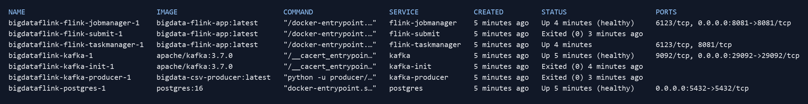
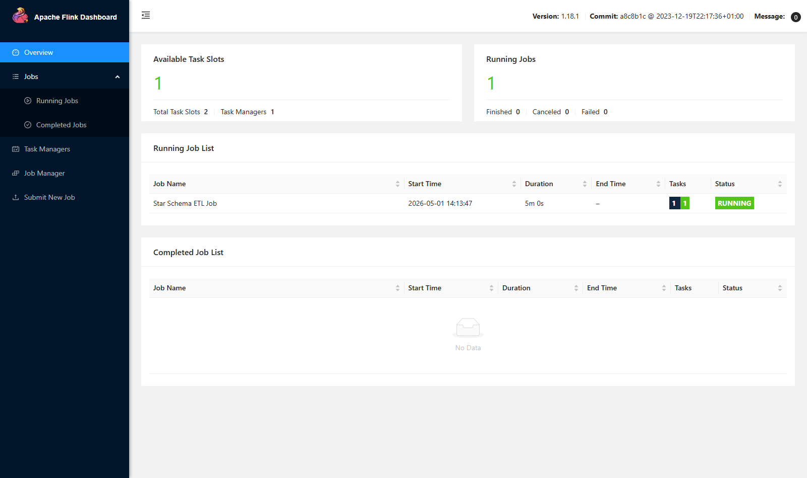
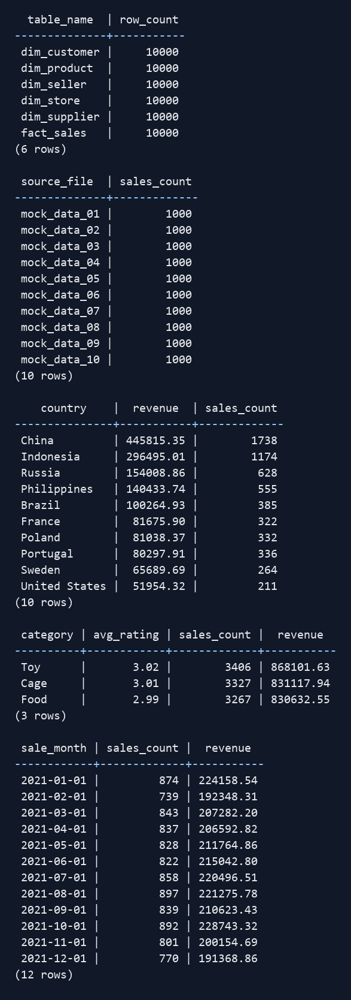

# Отчёт по лабораторной работе №3

Выполнил: Агафонов Андрей Сергеевич, М8О-315Б-23.

## Тема работы

Потоковая обработка данных с помощью Apache Flink.

## Цель работы

Собрать потоковую обработку данных:

`CSV -> Kafka -> Flink -> PostgreSQL`

Данные из CSV отправляются в Kafka в формате JSON. Затем Flink читает сообщения из Kafka и сохраняет результат в PostgreSQL по схеме "звезда".

## Использованные инструменты

- Docker Compose
- PostgreSQL 16
- Apache Kafka 3.7.0
- Apache Flink 1.18.1
- Python 3.11

## Архитектура

Запуск сделан через один `docker-compose.yml`.

1. `postgres` создаёт БД `pet_shop` и таблицы схемы звезды.
2. `kafka` поднимает брокер сообщений.
3. `kafka-init` создаёт топик `pet-shop-sales`.
4. `flink-jobmanager` и `flink-taskmanager` запускают Flink-кластер.
5. `flink-submit` запускает PyFlink job.
6. `kafka-producer` читает CSV-файлы и отправляет строки в Kafka.

## Исходные данные

Использованы 10 CSV-файлов из папки `исходные данные`, по 1000 строк в каждом. Всего отправляется 10000 сообщений.

В каждом файле `id` идёт в диапазоне 1-1000. Для загрузки 10000 строк producer формирует общий диапазон ключей и передаёт его в поля:

- `id`
- `sale_customer_id`
- `sale_seller_id`
- `sale_product_id`

Первый файл даёт ID 1-1000, второй 1001-2000 и т.д.

## Реализованная схема данных

В PostgreSQL создаются таблицы:

- `dim_customer`
- `dim_seller`
- `dim_product`
- `dim_store`
- `dim_supplier`
- `fact_sales`

`fact_sales` хранит факт продажи: дату, количество, сумму и внешние ключи на измерения.

Для клиента, продавца и товара используются подготовленные ID из входных данных. Для магазина и поставщика ID считается через MD5-хеш от набора полей, потому что отдельных идентификаторов для них в CSV нет.

## Реализация Flink job

Flink job написана на PyFlink DataStream API.

`FlinkKafkaConsumer -> map(PostgresStarSchemaSink) -> print`

`PostgresStarSchemaSink` наследуется от `MapFunction`:

- `open()` создаёт соединение с PostgreSQL;
- `map()` разбирает JSON, вставляет измерения, затем факт;
- `close()` закрывает соединение;
- при ошибке выполняется `rollback()`.

Для вставки используется `INSERT ... ON CONFLICT DO NOTHING`. Записи с уже существующим ключом пропускаются.

## Результаты проверки

Количество строк после загрузки:

| Таблица | Количество строк |
|---|---:|
| `fact_sales` | 10000 |
| `dim_customer` | 10000 |
| `dim_seller` | 10000 |
| `dim_product` | 10000 |
| `dim_store` | 10000 |
| `dim_supplier` | 10000 |

Распределение по исходным файлам: по 1000 продаж на каждый `mock_data_01` ... `mock_data_10`.

Примеры аналитических результатов:

| Запрос | Результат |
|---|---|
| Топ страна по выручке | `China`, `445815.35` |
| Категория с наибольшим числом продаж | `Toy`, `3406` продаж |
| Месяц с максимальной выручкой | октябрь 2021, `228743.32` |

Проверочные запросы находятся в `sql/check_results.sql`.

## Иллюстрации

Состояние контейнеров после запуска:

Flink Dashboard с запущенной job:

Результат проверочных SQL-запросов:

## Контрольные вопросы

**Что означает денормализованная запись?**

В исходном CSV одна строка содержит сразу данные клиента, продавца, товара, магазина, поставщика и продажи. Из-за этого описательные данные повторяются в разных строках. Например, информация о товаре и продавце хранится рядом с каждой продажей, хотя логически это отдельные сущности.

**Чем таблица фактов отличается от таблиц измерений?**

Таблицы измерений отвечают на вопросы "кто", "что", "где": клиент, товар, продавец, магазин, поставщик. Таблица фактов хранит событие продажи и числовые меры: количество и сумму. Поэтому факт содержит внешние ключи на измерения и вставляется после них.

**Зачем подготавливать ID по файлам?**

Все 10 CSV-файлов содержат одинаковые `id` 1-1000. Для таблицы фактов нужен общий диапазон уникальных ключей на 10000 строк. Такие же значения нужны для `sale_customer_id`, `sale_seller_id`, `sale_product_id`, чтобы связи фактов с измерениями оставались корректными.

**Что такое `KAFKA_ADVERTISED_LISTENERS`?**

Это адреса, которые Kafka отдаёт клиентам для подключения. Внутри Docker используется `kafka:9092`, потому что `localhost` внутри контейнера указывает на сам контейнер. Для подключения с хоста открыт `localhost:29092`.

**Что делает `set_start_from_earliest()`?**

`set_start_from_earliest()` задаёт чтение топика с начала, когда для consumer group отсутствует сохранённый offset. Для конфликтующих ключей в PostgreSQL используется `ON CONFLICT DO NOTHING`.

**Зачем после `map()` стоит `print()`?**

В DataStream API преобразования ленивые: нужен терминальный оператор, чтобы граф реально выполнялся. В этой работе запись в PostgreSQL происходит как побочный эффект внутри `map()`, а `print()` завершает граф и выводит короткий статус обработки сообщения.

## Вывод

В ходе работы был собран потоковый конвейер в Docker. Данные отправляются в Kafka, обрабатываются Flink job и сохраняются в PostgreSQL по схеме "звезда". В PostgreSQL загружаются 10000 строк исходных данных.
